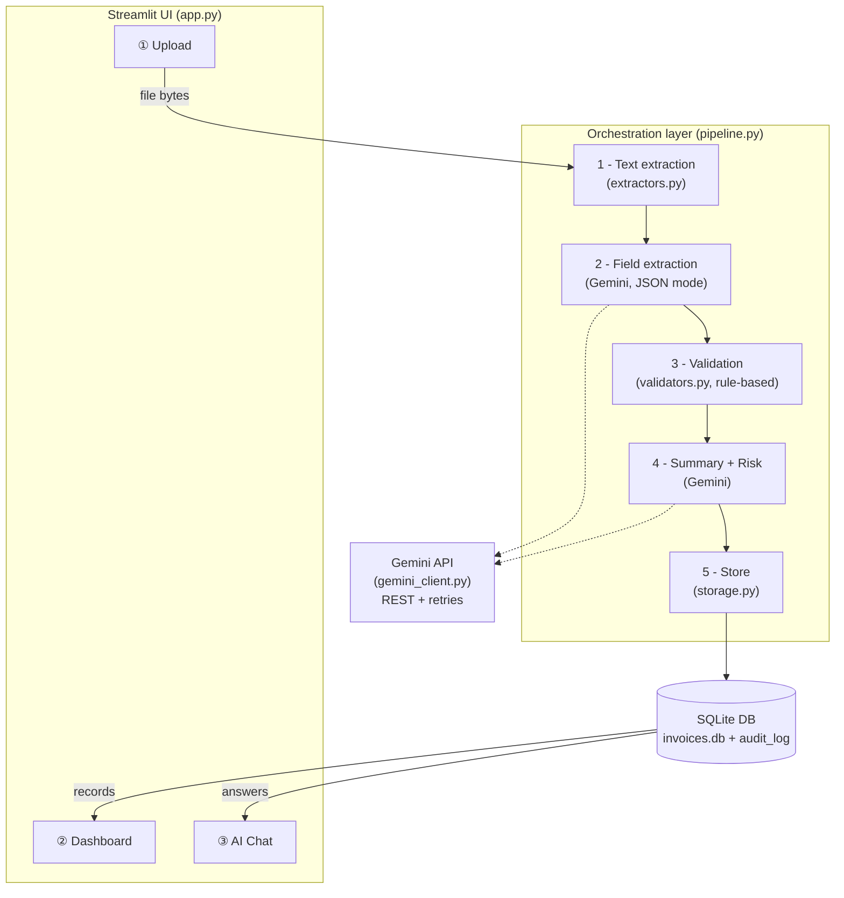

# 🧾 Invoice AI — Document Automation Pipeline

An end-to-end AI automation solution that ingests invoices (PDF, image, or text),
extracts structured data, validates it, assesses risk with an LLM, stores results,
and answers questions through a chat assistant.

**🔗 Live demo:** https://invoiceai-npg6kpyfgnshyt3vxws9nr.streamlit.app

**💻 Source:** https://github.com/Raj1192/INVOICE_AI

---

## Architecture



## Pipeline flow

```
Upload Document -> OCR / Parsing -> LLM Field Extraction -> Rule-based Validation
-> LLM Summary & Risk Detection -> Store (SQLite + audit log) -> Dashboard / Chat
```

## Output contract (per task spec)

```json
{
  "vendor": "ACME Software GmbH",
  "invoice_number": "INV-2026-0042",
  "invoice_date": "2026-05-28",
  "amount": "EUR 4,249.50",
  "summary": "Invoice from ACME Software GmbH for AI development services...",
  "risk_level": "LOW"
}
```

---

## Workflow design

1. **Text extraction** (`extractors.py`) — `pdfplumber` for digital PDFs; pages
   with no text layer (scans) and image uploads are OCR'd with **Gemini Vision**,
   which removes the tesseract system dependency and keeps cloud deployment simple.
2. **Structured extraction** — Gemini is called in **JSON mode** with a strict
   schema prompt; the response is parsed defensively (`parse_json_response`).
3. **Validation** (`validators.py`) — deliberately **rule-based, not LLM-based**:
   required-field checks, amount parsing, date-format and plausibility checks.
   Rules are cheap, deterministic, auditable, and never hallucinate.
4. **Summary + risk** — a second LLM call receives the fields *and* the
   validation result and returns a summary, a LOW/MEDIUM/HIGH risk level, and
   human-readable reasons.
5. **Storage** (`storage.py`) — SQLite with an `invoices` table and an
   `audit_log` table that records every pipeline event with a UTC timestamp.

## LLM used

**Google Gemini (`gemini-2.5-flash-lite`)** via the raw REST API (`requests`),
chosen for:
- a free tier (no credit card needed for the demo)
- native multimodal input → doubles as the OCR engine for image/scanned invoices
- JSON response mode for reliable structured extraction

The client (`gemini_client.py`) demonstrates full API-integration hygiene:
**authentication** (key read from env/secrets, never hard-coded), **error handling**
(timeouts, HTTP status handling, exponential-backoff retries on 429/5xx), and
**response processing** (safe payload navigation, safety-filter detection,
markdown-fence-tolerant JSON parsing).

> **Note on model choice:** the model name is configurable via the `GEMINI_MODEL`
> environment variable and defaults to `gemini-2.5-flash-lite`. The older
> `gemini-2.0-flash` model was dropped from the free tier (Dec 2025), so the code
> targets a current free-tier Flash model. The LLM call is isolated in a single
> module, so OpenAI / OpenRouter / HuggingFace could be swapped in without
> touching the rest of the pipeline.

## Automation approach

Custom Python orchestration (`pipeline.py`) rather than n8n/Zapier: a single
`process_document()` function chains the five stages, reports progress to the UI
through a callback, and logs every stage to the audit trail. This keeps the whole
flow versionable, testable, and dependency-light. The same stages map 1:1 onto
n8n nodes (Webhook -> Code -> HTTP Request -> DB) if a low-code runner is preferred.

## Future improvements

- **Vector database + RAG** for multi-document Q&A across the whole invoice history
- **Multi-agent split** (extractor / validator / risk-analyst agents with a supervisor)
- Human-in-the-loop review queue for MEDIUM/HIGH risk invoices
- Postgres + object storage instead of SQLite for multi-user production
- User authentication (e.g. streamlit-authenticator) and per-user data isolation
- Cost tracking per LLM call (token counts are returned in the Gemini response)
- Duplicate-invoice detection (hash + fuzzy vendor/amount matching)

---

## Run locally

```bash
git clone https://github.com/Raj1192/INVOICE_AI.git
cd INVOICE_AI
python -m venv venv
venv\Scripts\activate            # Windows (Mac/Linux: source venv/bin/activate)
pip install -r requirements.txt
```

Add your key — create a file `.streamlit/secrets.toml` containing:

```toml
GEMINI_API_KEY = "your-key"      # free key from https://aistudio.google.com/apikey
```

Then run:

```bash
streamlit run app.py
```

A `sample_invoice.pdf` is included for testing.

## Deploy to Streamlit Cloud (public URL)

1. Push this repo to GitHub (public repo).
2. Go to https://share.streamlit.io -> **Create app** -> select the repo, branch
   `main`, main file `app.py`.
3. In **Advanced settings -> Secrets**, paste:
   ```toml
   GEMINI_API_KEY = "your-key"
   ```
4. Deploy — you get a public `https://<app-name>.streamlit.app` URL.

> Note: on Streamlit Cloud the SQLite file lives on ephemeral storage, so the
> dashboard resets when the app restarts — acceptable for a demo, and called out
> as a known limitation (production would use a managed database).

## Docker (bonus)

```bash
docker build -t invoice-ai .
docker run -p 8501:8501 -e GEMINI_API_KEY="your-key" invoice-ai
```

## Project structure

```
app.py             Streamlit UI (upload / dashboard / chat)
pipeline.py        Orchestration of the 5-stage automation flow
extractors.py      PDF / image / text -> raw text (Gemini Vision as OCR)
gemini_client.py   REST client: auth, retries, error handling, JSON parsing
validators.py      Deterministic rule-based field validation
storage.py         SQLite persistence + audit logging
sample_invoice.pdf Demo document
Dockerfile         Container deployment (bonus)
```
